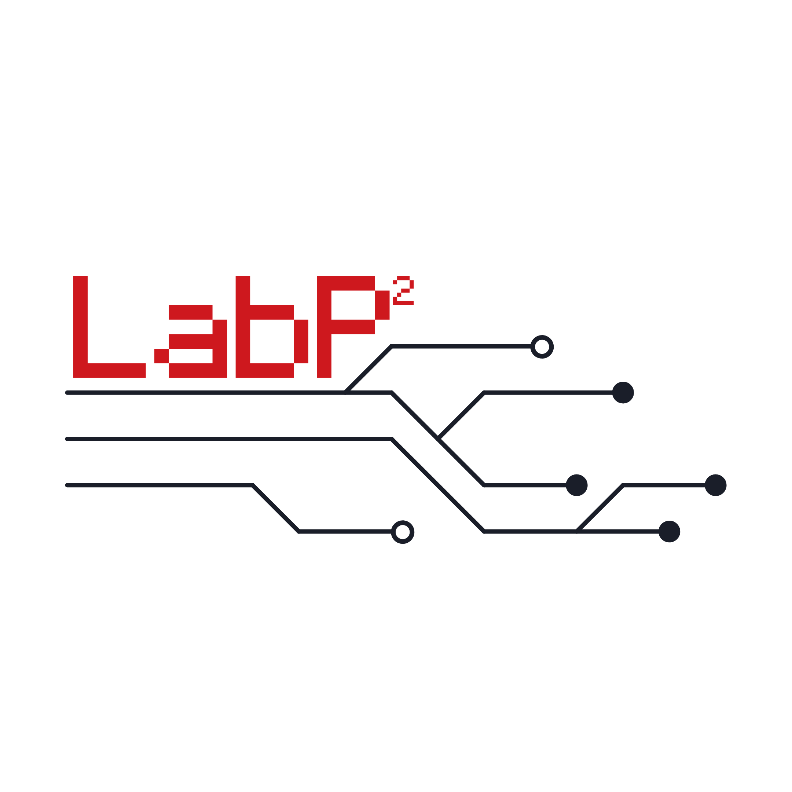
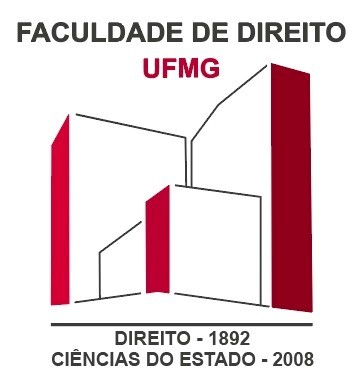

# Gestão Legal UFMG

<p align="center">
  
</p>

Sistema de Gestão de Assistências Judiciárias e Escritórios de Advocacia Modelo

---

## Sobre

Sistema desenvolvido pelo projeto de extensão da Faculdade de Direito da UFMG [Gestão Legal](https://gestaolegal.direito.ufmg.br/) para auxiliar o gerenciamento e funcionamento da [Divisão de Assistência Judiciária - DAJ](https://daj.direito.ufmg.br/).

O **Gestão Legal é uma iniciativa do LAB P² — Laboratório de Tecnologias Públicas para o Setor Público**, da Faculdade de Direito da UFMG.

O laboratório desenvolve e integra tecnologias livres e abertas para atender às necessidades das instituições públicas. Reúne estudantes, professores e servidores em projetos que articulam ensino, pesquisa, extensão e gestão, promovendo formação interdisciplinar, compartilhamento de soluções e autonomia tecnológica. [Conheça o LAB P²](https://labp2.direito.ufmg.br/o-projeto/).

<table>
  <tr>
    <td align="center"><a href="https://labp2.direito.ufmg.br/"></a></td>
    <td align="center"><a href="https://www.direito.ufmg.br/"></a></td>
    <td align="center"><a href="https://ufmg.br/"></a></td>
  </tr>
  <tr>
    <td align="center">LAB P²</td>
    <td align="center">Faculdade de Direito</td>
    <td align="center">UFMG</td>
  </tr>
</table>

### Funcionalidades

- Gestão de casos jurídicos e processos
- Cadastro e acompanhamento de clientes
- Controle de orientações jurídicas
- Gerenciamento de equipe (orientadores, estagiários, colaboradores)
- Acompanhamento de eventos e prazos processuais
- Upload e gerenciamento de documentos
- Organização dos atendimentos por unidade
- Escalas de plantão, fila de atendimento e registro de presença

---

## Requisitos

- **Python 3.11+**
- **Docker** e **Docker Compose** (recomendado)
- **Node.js 24** (apenas para desenvolvimento do frontend, como nas imagens Docker)

---

## Instalação

### Usando Docker (Recomendado)

1. **Clone o repositório**
   ```bash
   git clone https://github.com/gestaolegalufmg/gestaolegal.git
   cd gestaolegal
   ```

2. **Configure as variáveis de ambiente**
   ```bash
   cp .env.example .env
   ```

   Edite o arquivo `.env` e configure as credenciais necessárias.

3. **(Opcional) Configure override para desenvolvimento**

   Para customizar o ambiente de desenvolvimento (portas, volumes, variáveis extras):
   ```bash
   cp docker-compose.override.example.yml docker-compose.override.yml
   ```

   Edite o `docker-compose.override.yml` conforme necessário.

4. **Inicie o ambiente**
   ```bash
   make up
   ```

5. **Acesse o sistema**
   - Frontend: http://localhost:5001
   - API Backend: http://localhost:5000

6. **Crie o administrador inicial**

   Acesse http://localhost:5001/setup-admin e use o token configurado em `ADMIN_SETUP_TOKEN`.

---

## Documentação

- 📖 [Wiki do Projeto](https://github.com/gestaolegalufmg/gestaolegal/wiki) - Documentação completa
- 🏗️ [Arquitetura](https://github.com/gestaolegalufmg/gestaolegal/wiki/Arquitetura) - Detalhes técnicos e stack
- 🔧 [Guia de Contribuição](CONTRIBUTING.md) - Como contribuir
- [Problemas conhecidos](docs/known_issues.md) - Limitações atuais e correções já entregues
- 🐛 [Reportar Issues](https://github.com/gestaolegalufmg/gestaolegal/issues) - Bugs e melhorias

---

## Contribuindo

Contribuições são bem-vindas! Por favor:

1. Leia o [guia de contribuição](CONTRIBUTING.md)
2. Crie uma branch para sua feature
3. Faça commit das mudanças
4. Abra um Pull Request

---

## Licença

Este projeto está licenciado sob os termos especificados no arquivo [LICENSE](LICENSE).

---

## Suporte

- **Issues:** [GitHub Issues](https://github.com/gestaolegalufmg/gestaolegal/issues)
- **Wiki:** [Documentação](https://github.com/gestaolegalufmg/gestaolegal/wiki)
- **Site:** [gestaolegal.direito.ufmg.br](https://gestaolegal.direito.ufmg.br/)

---

**Status:** Em desenvolvimento ativo — versão 3.0

Uma iniciativa do [LAB P²](https://labp2.direito.ufmg.br/), da [Faculdade de Direito da UFMG](https://www.direito.ufmg.br/).
